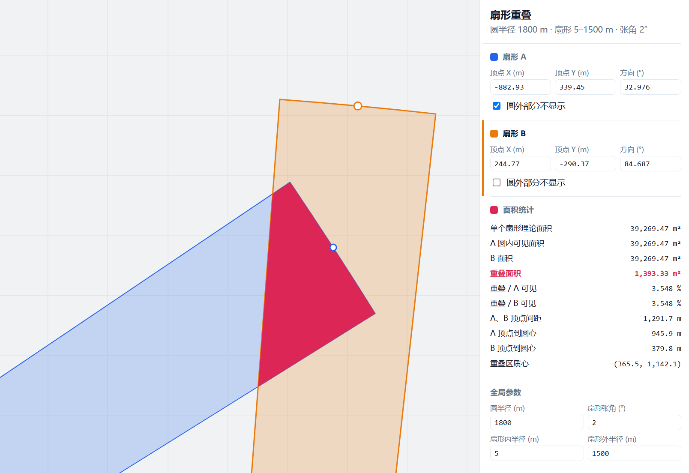

ok ok anyway


# 两扇形相交可视化

一个用原生 HTML + JavaScript 写的小页面，用来交互式地展示**两个扇形的相交区域**：拖动参数，实时看到重叠部分的形状和面积怎么变。

做数学建模的时候为了搞清楚一个几何关系顺手写的。

## 预览


<!--  -->

## 快速开始

当然，不需要安装任何依赖。

**方式一**：直接双击 `index.html`，用浏览器打开。

**方式二**（听说可以避免极个别浏览器的本地文件限制）：

```bash
# 在项目目录下起一个静态服务器
python -m http.server 8000
```

然后访问 http://localhost:8000

## 功能

- 调整两个扇形的**圆心位置、半径、起始角、张角**
- 实时高亮显示相交区域
- 显示相交面积的数值

> 具体有哪些控件以你页面里实际做的为准，可以按需增删上面这几条。

## 数学原理

！！！！！！

两个扇形的相交，本质上是先求两圆的交，再用两个扇形的角度范围去裁剪。

**第一步：求两圆交点。**设两圆分别为 $(x_1,y_1,r_1)$、$(x_2,y_2,r_2)$，圆心距为 $d$，则

$$a=\frac{r_1^2-r_2^2+d^2}{2d},\qquad h=\sqrt{r_1^2-a^2}$$

交点位于两圆心连线上距 $C_1$ 为 $a$ 的点，沿垂直方向偏移 $\pm h$。$d>r_1+r_2$ 或 $d<|r_1-r_2|$ 时无交点。

**第二步：两圆重叠区域（透镜形）的面积。**

$$S=r_1^2\arccos\frac{d^2+r_1^2-r_2^2}{2dr_1}+r_2^2\arccos\frac{d^2+r_2^2-r_1^2}{2dr_2}-\frac{1}{2}\sqrt{(-d+r_1+r_2)(d+r_1-r_2)(d-r_1+r_2)(d+r_1+r_2)}$$

**第三步：角度裁剪。**扇形不是整圆，还要判断交点和圆弧是否落在各自的角度区间内。边界情况（一个扇形完全包含另一个、只有一条边相切、交点落在角度区间外等）需要分类讨论——页面里的实现细节见源码注释。

## 文件结构

```
math/
├── index.html    
└── README.md
└── preview.png
```


## License

MIT
